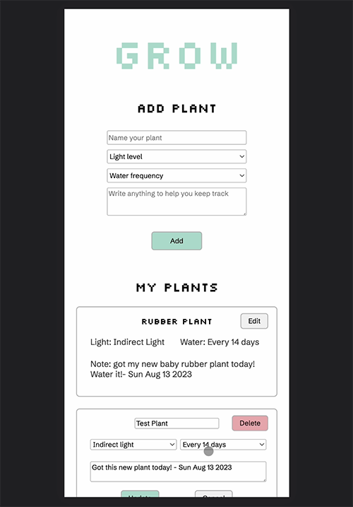

# Grow 🌱

Grow is a full-stack plant care tracking application. Born out of a 24-hour hackathon challenge, it provides users with a platform to maintain their plants' well-being. From adding a new plant, tracking its sunlight needs, to taking notes about its care, Grow encapsulates it all.

📱 **Demo Video** 👀

## Features

**Plant Tracking**: Add your plants and monitor their care requirements.
**Watering & Sunlight**: Set specific watering schedules and sunlight needs for each plant.
**Notes**: Keep custom notes for every plant, ensuring personalized care.
**Upcoming**: Features in the pipeline include user profile management, watering reminders, profile sharing, and more.

## Tech Stack

**Frontend**: Designed using Figma, and built on the MERN stack.
**Backend**: Express.js with Node.js, paired with MongoDB for data management.

